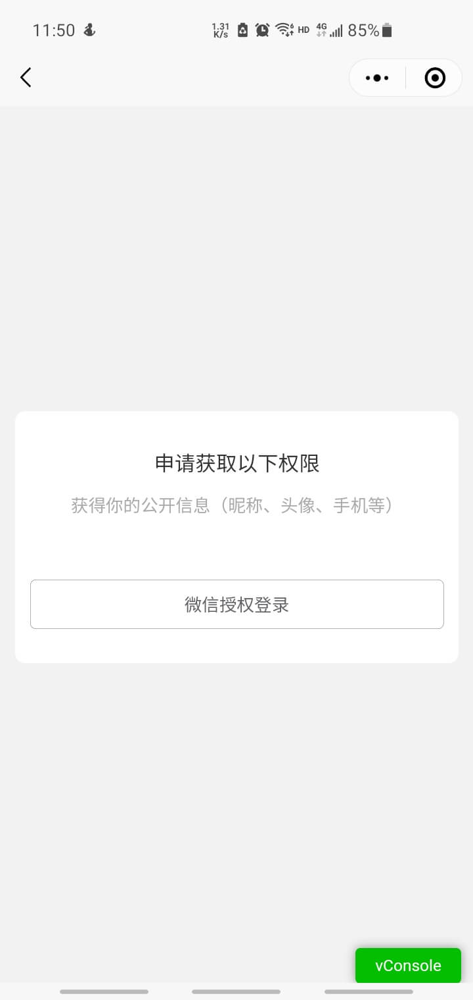
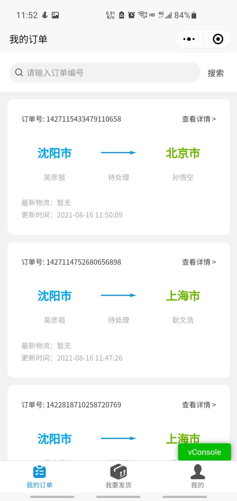
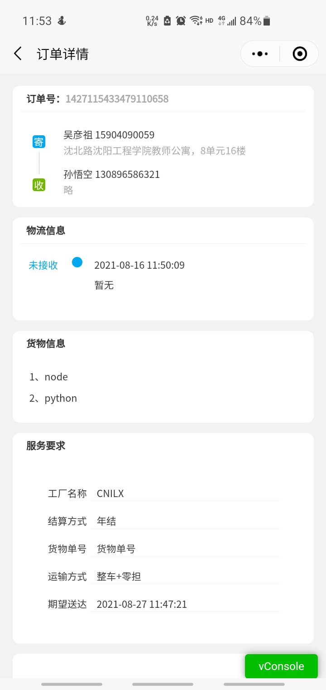
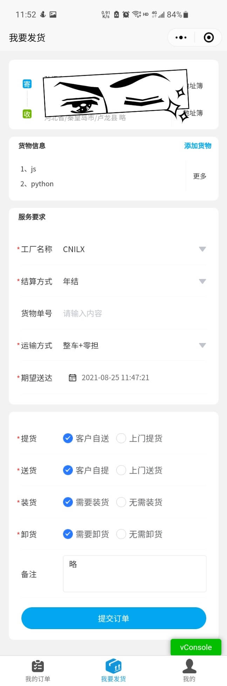

# 智慧物流用户端小程序

## 介绍

> 基于Vue.js和uni-app开发的小程序

## 演示

### 授权登录

### 订单列表

### 订单详情

### 发货页面

### 个人中心

### 地址簿

## 项目依赖

### [vuejs](https://cn.vuejs.org/)

> 渐进式JavaScript 框架
>
> 示例 https://cn.vuejs.org/v2/examples/
>
> DOC https://cn.vuejs.org/v2/api/

## 使用

### [下载 HbuilderX](https://www.dcloud.io/hbuilderx.html)

> 使用 HbuilderX 导入项目运行到小程序即可